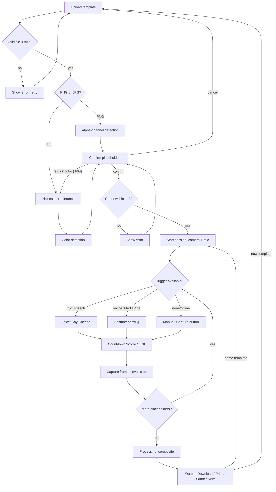

# Paktyur — Client-Side Photo Booth

A production-quality, **100% client-side** photo booth web app. Upload a
template image, the app detects photo placeholder regions, runs a hands-free
camera session (voice or ✌️ gesture trigger), and composites your photos into
the template for download or print.

Pure **HTML + CSS + vanilla JavaScript (ES modules)**. No backend, no build
step, no frameworks. The only external dependency is **MediaPipe Tasks Vision**,
loaded from CDN and used *only* for the optional gesture trigger.

---

## Running

ES modules and `getUserMedia` require a real HTTP(S) origin — opening
`index.html` via `file://` will **not** work. Serve it locally:

```bash
cd Paktyur
python3 -m http.server 8000
# open http://localhost:8000 in Chrome
```

Camera/microphone need a **secure context**: `localhost` is fine; any other
host must be **HTTPS**.

---

## How placeholder detection works

Both paths produce a boolean mask of "candidate" pixels, then run
**Connected Component Labeling** (iterative BFS flood fill, 4-connected) in
[`js/placeholderDetector.js`](js/placeholderDetector.js). Any component that
touches the image border is treated as background and discarded. Surviving
components are validated against size/area limits, sorted **top→bottom then
left→right**, and numbered.

### PNG templates (transparency)
The alpha channel is scanned; any pixel with `alpha ≤ ALPHA_TRANSPARENT_THRESHOLD`
is a candidate. So the "holes" in your template must be **fully transparent**
(erased), not white.

### JPG/JPEG templates (color key)
JPEG has no transparency, so you pick the placeholder color:

1. The template is displayed on a canvas.
2. Hover shows a **magnified loupe** around the cursor.
3. Click a placeholder to store its RGB value.
4. A **tolerance slider** controls matching (Euclidean RGB distance).
5. Detection runs; adjust tolerance and re-run as needed.

Make JPG templates with **solid, uniform color blocks** (e.g. pure magenta)
where photos should appear.

---

## Configuration

All tunables live in [`js/config.js`](js/config.js):

| Constant | Purpose | Default |
|---|---|---|
| `MAX_WIDTH` / `MAX_HEIGHT` | Max template dimensions | 4000 |
| `MIN_PLACEHOLDER_WIDTH/HEIGHT/AREA` | Reject regions that are too small | 150 / 150 / 25000 |
| `MAX_PLACEHOLDER_WIDTH/HEIGHT/AREA` | Reject regions that are too large | 1500 / 1500 / 600000 |
| `MIN_PHOTOS` / `MAX_PHOTOS` | Allowed placeholder count | 1 / 8 |
| `ALPHA_TRANSPARENT_THRESHOLD` | PNG transparency cutoff | 16 |
| `DEFAULT_COLOR_TOLERANCE` | JPG initial color tolerance | 15 |
| `GESTURE_STABLE_MS` / `GESTURE_COOLDOWN_MS` | Hold time / re-trigger lockout | 1000 / 3000 |
| `VOICE_KEYWORDS` / `VOICE_TIMEOUT_MS` | Voice trigger words / silence restart | `["cheese",…]` / 15000 |
| `COUNTDOWN_START` / `COUNTDOWN_TICK_MS` | Countdown length / pace | 3 / 800 |

---

## Capture modes

The app picks the best available hands-free trigger, in order:

1. **Voice** — Web Speech API (`SpeechRecognition` / `webkitSpeechRecognition`).
   Continuous, case-insensitive listening for "Cheese"; unrelated speech is
   ignored; recognition auto-restarts after silence. Prompt: *Say "Cheese"*.
2. **Gesture (✌️)** — MediaPipe Hand Landmarker (CDN). Detects a peace sign
   (index + middle extended; ring, pinky, thumb folded) held ~1 s, with a
   cooldown to prevent double-fires. Prompt: *Show a ✌️ hand sign*.
3. **Manual** — a **Capture** button, used when neither of the above is
   available.

After any trigger: a fullscreen **3 → 2 → 1 → CLICK!** countdown plays (with an
optional WebAudio shutter tone), then one frame is captured and cover-cropped
(`object-fit: cover; center`, aspect preserved, overflow cropped, never
stretched) into the current placeholder.

---

## Permissions & fallback behavior

- **Camera** — required. Requested when the session starts; the session cannot
  proceed without it. You can switch cameras when more than one is available.
- **Microphone** — optional. If granted *and* speech recognition is supported,
  voice mode is used. If denied/unavailable, the app falls back to gesture.
- **Gesture needs the internet** (MediaPipe loads from CDN). When
  `navigator.onLine` is false, or the CDN/model fails to load, gesture is
  **disabled entirely** and the app falls back to manual capture. Connectivity
  changes are watched live: losing the network mid-session drops gesture to
  manual; regaining it (with no voice) re-enables gesture.

---

## Browser compatibility

| Browser | Voice | Gesture | Notes |
|---|---|---|---|
| Chrome | ✅ | ✅ | Primary target |
| Edge | ✅ | ✅ | Full support |
| Safari | ⚠️ | ✅ | SpeechRecognition partial; camera OK |
| Firefox | ❌ | ✅ | No SpeechRecognition → gesture/manual |

Performance features degrade gracefully: `OffscreenCanvas` and
`createImageBitmap` are feature-detected with canvas fallbacks.

---

## Performance & memory

`createImageBitmap` for async decode; `OffscreenCanvas` where supported;
reused work canvas; `ImageBitmap.close()` after compositing; object URLs
revoked after use; camera/mic tracks stopped when the session ends; BFS labeling
yields to the event loop so large templates don't freeze the UI.

---

## Project structure

```
index.html
styles.css
js/
  app.js                 orchestrator / 12-step state machine
  config.js              all tunable constants
  camera.js              getUserMedia, device switching, frame capture
  microphone.js          mic permission + voice trigger
  gesture.js             MediaPipe ✌️ trigger (CDN, offline-aware)
  placeholderDetector.js PNG alpha + JPG color CCL detection
  imageProcessor.js      decode, validate, cover-crop, composite, export
  ui.js                  screens, loupe, overlays, countdown, errors
  utils.js               validation, feature detection, cleanup helpers
```

---

## Flow



---

© 2026 Project Kilaw
